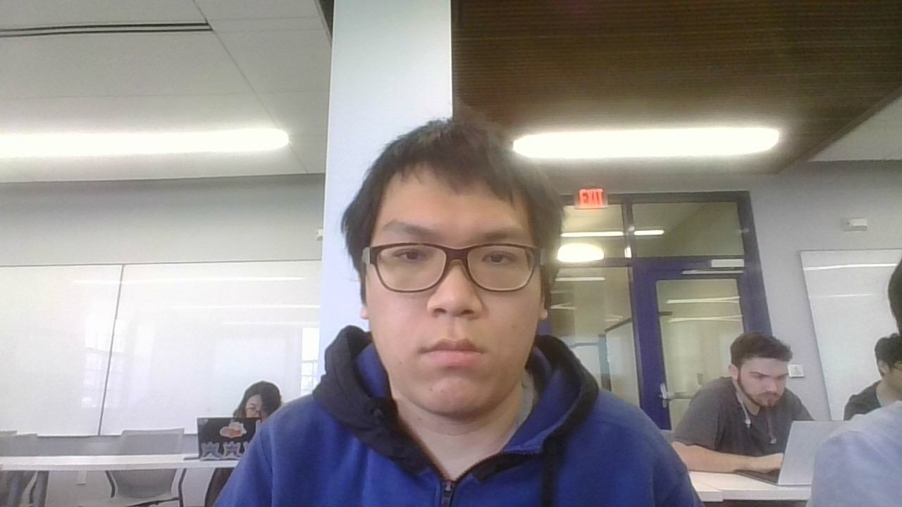

# lab2part1
* Name: Minke Yu
* email: yum4@rpi.edu 
* github account: ymkymkymkymx
* slack handle: ymk
* graduating year: 2021 perhaps? Or maybe I can get stuck here for years?
* my interests: C++,Java,Python programming, and anything that deal with algorithms
* Photo of Mark Yu 
